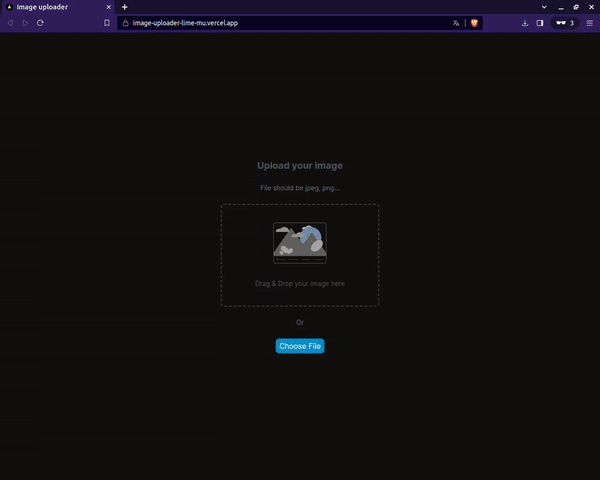

<h1 align="center">image-uploader</h1>

<div align="center">
   Solution for a challenge from  <a href="http://devchallenges.io" target="_blank">Devchallenges.io</a>.
</div>

<div align="center">
  <h3>
    <a href="https://vercel.com/ignaciovigo/image-uploader">
      Demo
    </a>
    <span> | </span>
    <a href="https://github.com/ignaciovigo/image-uploader">
      Solution
    </a>
    <span> | </span>
    <a href="https://devchallenges.io/challenges/O2iGT9yBd6xZBrOcVirx">
      Challenge
    </a>
  </h3>
</div>

<!-- TABLE OF CONTENTS -->

## Table of Contents

- [Table of Contents](#table-of-contents)
- [Overview](#overview)
  - [Built With](#built-with)
- [Features](#features)
- [How To Use](#how-to-use)
- [Contact](#contact)

<!-- OVERVIEW -->

## Overview



In this project, you have the option to upload images by either clicking the "Choose file" button or simply dragging and dropping your image into the designated area within the interface. Once the image is successfully uploaded, you will receive a URL link.

To explore the project further, visit the following link: [Click here to see it in action](https://image-uploader-lime-mu.vercel.app/)


### Built With

- [NextJs](https://nextjs.org/)
- [Cloudinary](https://cloudinary.com)
- [React](https://reactjs.org/)
- [Tailwind](https://tailwindcss.com/)

## Features

This application/site was created as a submission to a [DevChallenges](https://devchallenges.io/challenges) challenge. The [challenge](https://devchallenges.io/challenges/O2iGT9yBd6xZBrOcVirx) was to build an application to complete the given user stories.

## How To Use

<!-- Example: -->

To clone and run this application, you'll need [Git](https://git-scm.com) and [Node.js](https://nodejs.org/en/download/) (which comes with [npm](http://npmjs.com)) installed on your computer. From your command line:

```bash
# Clone this repository
$ git clone https://github.com/ignaciovigo/image-uploader

# Install dependencies
$ npm install

# Run the app
$ npm run dev
```

## Contact

- GitHub [@ignaciovigo](https://github.com/ignaciovigo)
